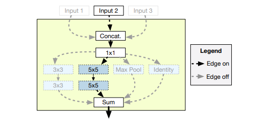
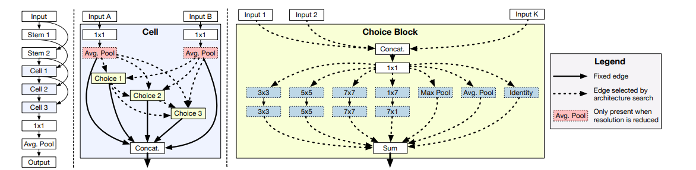
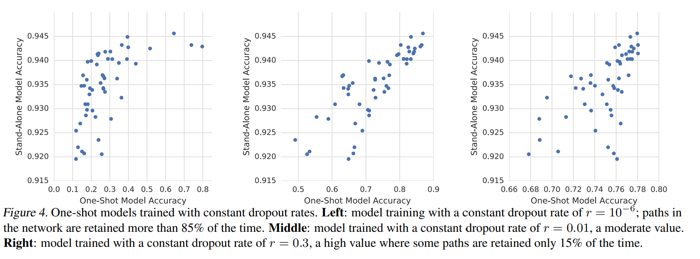
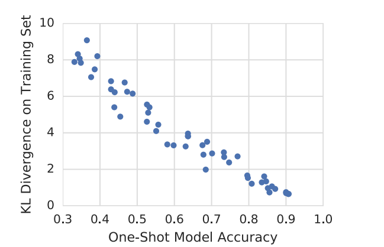

# Understanding and simplifying One-shot NAS

## Abstract
understanding weight sharing 

## Intro

### one shot NAS의 특징
1. search space is exponetially growth
2. the size of one-shot model is linearly growth

### one shot NAS의 한계
weight sharing이 가지는 inherent limit. -> sharing 된 상태에서 평가하는게 적절한가?

### Goal of this paper
1. hypernetwork, RL controller is not necessary.
2. zero out some operations and see how it affects.
 => Netwrok가 train 될때 자동으로 중요한 operation의 capacitiy를 고려해서 집중한다.
 
 
## one shot NAS previous works
1. SMASH
tried to address childe model traiing by using hypernetwork, 
The same fixed hypernetwork is used to evaluate many different child model
 => off-the-shelf technique

> 왜 SMASH는 NAS를 black-box optimization 문제로 생각하는 것일까?

2. Population based training (PBT)
hyperparameters를 training 도중 조정하는 것
> Exploitation: 지금까지 찾았던 것 중 best인 것을 더 연구 \
> Exploration : 지금까지 찾았던 것 말고 새로운 걸 더 연구
 => trade-off 관계

3. Genetic and evolution algorithm

4. MorphNet 
-> overcomplete Network and applying L1 regularization to induce sparsity.

5. ENAS
With parmaeter sharing, using RL controller to identify architectures.

## how to do One shot NAS
1. Design search space and allow us to represent wid and variety architecture.
 충분히 크면서 trainig가능할 정도로는 작아야한다. 
 search space의 디자인은 다양하게 할 수 있다 예를들어 입력 => (1) previous block (2) in same choice block

> search space design  \
> 1. identity 2. a pair of 3x3 depth-wise 3. a pair of 5x5 depth-wise \ 
> 4. a pair of 7x7 conv 5. 1x7 conv by 7x1 conv 6. max pooling 7. avg pooling 

 cell -> 4 choices \
 각 choice block은 1~ 2+i개의 input 가능 => 2^(i+1)-1 combiniation input \
 each choice block has one or two diffent op = 7+ 7C2 = 28 \
 => 6x10^9

2. train the on-shot model to make it predictive of validation acc
 training 때에는 모든 operation이 쓰이고 channel수를 고정해주기 위해 1x1 conv 사용.
3. evaluate candidate arch on validation set.
 evaluation 때는 single path, zeroing-out other operations
4. retrain the most promisng arch from scratch

## Robustness of co-adaptation
실제 one-shot NAS를 trainig을 하고 stand-alone model간의 correlation이 떨어지는 경향이 있다.
이를 위해서 robustness가 필요하다. path-drop!!!
하지만 choice block마다 확률이 달라진다.
따라서 choice block자체에 drop확률을 보정해준다 -> 7input path=> (0.05)^(1/7)

evaluation을 fair하게 하기 위해선 batch statistic을 알아야하지만 이를 조정하기 힘들다. batch normalization이 굉장히 stablizaing하는데 도움이 된다.

하지만 잘 안됐다. => ghost batch norm을 사용해서 batch norm을 partioning해서 사용했다.

## Eval candidates.
fixed probability distribution
 => can be replace any strategy

##  final model selection
one-shot best-performing arch and retrain from scratch multiple architecture.
F means # of filter

# Experiments insights

## Impact of dropout rate.

## What one-shot learn?
One-shot model learns importantanc of cell

sample된 path가 성능이 좋을 수록 one-shot NAS의 추정 분포와 비슷하다.

one-shot model내에서 고정된 sample arch가 어떻게 동작하는지 보여주는 그래프

