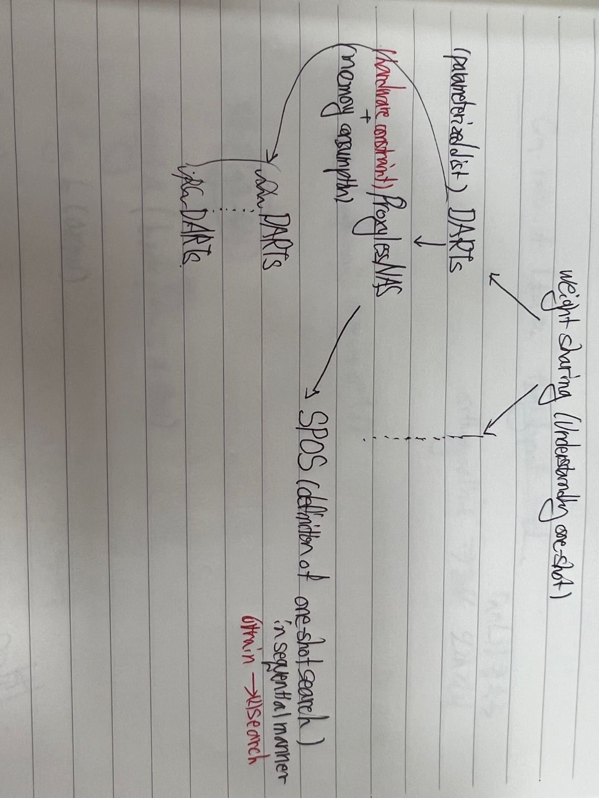
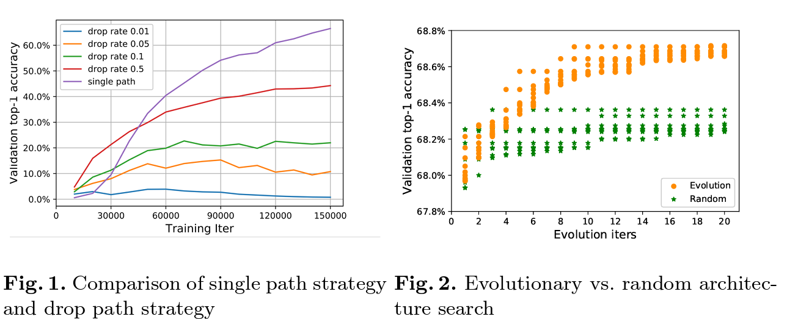
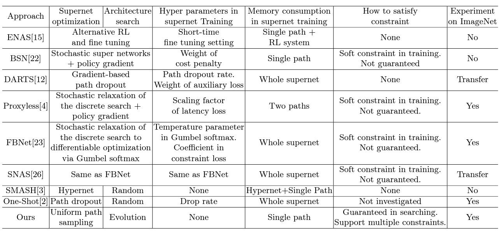
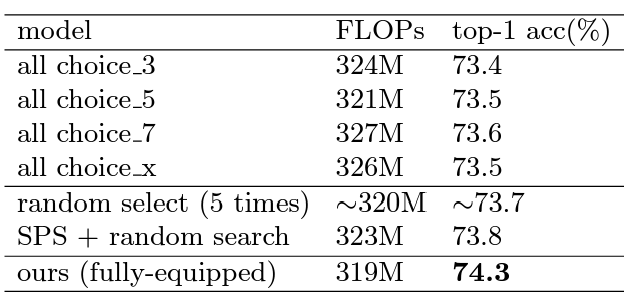
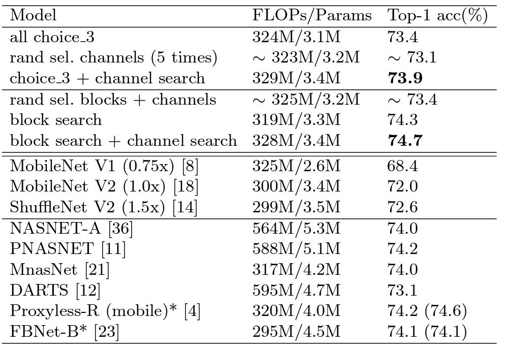
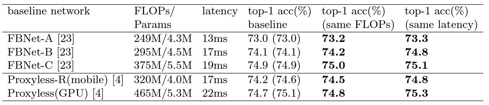
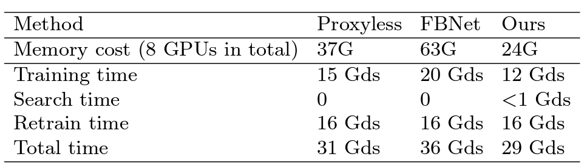
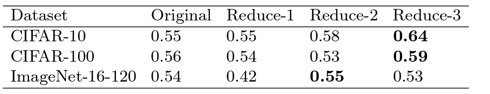

## SPOS

### Intro + related works 
1. continuous relaxation -> Proxylessnas

- jointly optimized via gradient based approach
 => it is unclear why?

- futher coupling between architecture 
 => becuas greedy behavior gradient based methods

2. One-shot paradigm  => coupling issue를 해결할 수 있다.

- 단지 architecture relaxation 이 없다.
=> training 후 seperate step으로 다뤄진다. 효율적이고 훨신 flexible하다

- 하지만 문제도 있다. 이전 One-shot NAS는 역시 coupling issue가 존재한다.
    => 그래서 optim이 힘들고, hyper parama에 sensitive하다. 결과도 잘 나오지 않았다.

> dillemma of exploitation and exploration

- 또 하나의 문제, Task constraints 를 모델의 성능과 동시에 고려하는 이전 방법들은 굉장히 어렵다. 그리고 hard constraint를 guarantee하지도 않는다.

###  Methods

1. Supernet을 train한다.
2. Architecture search는 validation acuracy를 극대화 하는 path를 선택한다.

가장 큰 장점은 어떤 supernet이든 가능하다, 어떤 search 방법을 적용해도 괜찮다!

또 다른 장점은 different constraint 인 경우에 search만 반복하면  된다.

1. 방법 1 single path를 uniform 하게 sampling해서 train한다.
=> Path drop method에 비해 훨씬 hyper-param free하다.

2. evolution algorithm을 통해 best architecture를 찾는다.
=> Random architecture search보다는 search method를 적용하는 것이 낫다

3. architecture constraint도 적용할 수 있다.(search algorithm을 적용할때)

4. Choice block
 
- Channel number search: output channel을 random sample해서 tensor를 잘라서 사용

- Mixed precision quantization search

5. Batch Norm : inference시에도 random subnet에 대해서 다시 recal

### 성능에 대한 random과 비교 table

### 성능에 대한 SOTA와 비교 table

### Search space가 좋은 테이블

### Search cost

### NAS-bench 201

