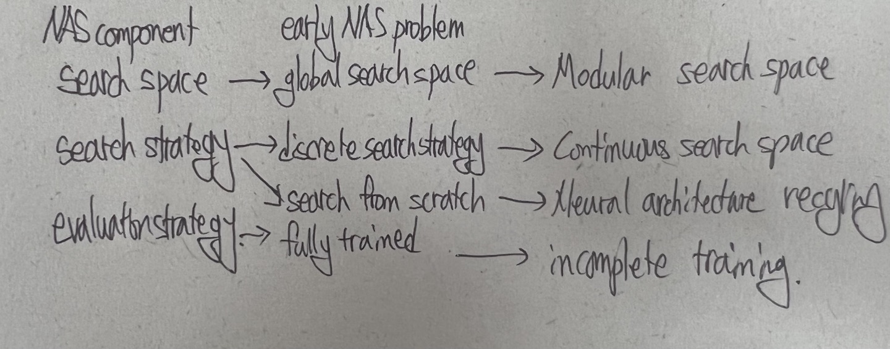

# A Comprehensive Survey of Neural Architecture Search: Challenges and Solutions

## Questions
1. Why continous search strategy is need?
2. What is difference between Search from scratch and Fully trained?

---

## Abstract

NAS is trying to overcome the difficult for human to jump out of their original thinking paradigm and esgine an optimal model.
This paper provides 4 elements related to NAS.
1. earlist NAS algorithm
2. problems in early NAS algorithms
3. subsequent related research works
4. analysis and comparison of recent works

---

## Introduction

NAS aims to 
1. best possible performance
2. efficient computing resource
3. minimal human intervention

First RL-based NAS works achieved SOTA on cifar10, so they showed us the NAS method is feasible.
Subsequently, large-scale evolution once a gain verify NAS is feasible.
Then, many works tried to reduce computation resources.
After the NAS was improved enough, many application works on object dection, adversarial learning etc. has been done.
However, NAS method is hard to compare because they have different search space, hyperparameter, and tricks.
Some works NAS-bench101, NAS-bench201 is trying to unify evaluation platform for polular NAS methods.

early works tried to train candidates from scratch during architecture search phase.
ENAS propose to accerlerate the architecture search process using parameter shaing strategy.
DNA propose to modularize the large search space of NAS into blocks. DNA helps to reduce representation shift problem. 
GDAS-NSAS proposes a NSAS loss function to solve multi-model problem.

Previous survey focus on categorizing researchs based on basic components of NAS which are (1) search space, (2) search strategy, (3) evaluation strategy

---

> representation shift problem:

> multi-model forgetting: \
> In case of weight sharing model, training new neural architecture leads to redcue the perforamnce of previous neural architecture.

---

## Early NAS works
1. NAS_RL: Model architecture can be represented in sequnce of string, so use RNN to produce model architecture and train RNN by reinforce learning
2. MetaQNN: Define NAS on markov decision process and use Q-learning.
3. Large-scale evolution: use evolutionary algorithms(EAs) to select optimal model
4. GeNet : use EAs, propoes a new neural architecture coding scheme in fixed-length binary string and employs predefined evolutionary operation to binary string.

These early NAS methods has four limitations.
1. Search space is too large.
2. Cannot use gradient strategy??
3. Search from scratch ?
4. Fully trained ?

Search space -> NASNet, MNASNet -> how to handle skip connection in NAS? 
MNASnet -> repeating structure

---
> Definition of search space  in NAS: \
> predefined candidate operations sets + hyper-parameters( architecture template, connnection method, # of layer channel)

> Evolutionary algroithms(EAs)

